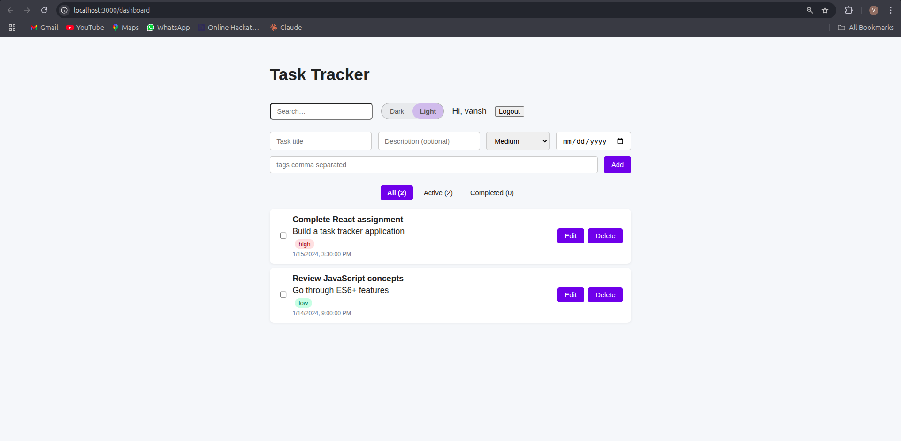

# Personal Task Tracker

A minimal yet feature-rich task management SPA built with React. Track todos, set priorities & due dates, tag tasks, and switch seamlessly between light and dark themes.

## 🚀 Features
- Add, edit, delete and complete tasks
- Priority, due-date & tag metadata
- Filter: All / Active / Completed
- Instant search across title, description & tags
- LocalStorage persistence (tasks + theme)
- Animated pill toggle for Dark/Light mode
- Simple login (username stored locally) & logout
- Responsive design (mobile ↔ desktop)

## 🛠 Setup Instructions
```bash
# Clone repository
git clone https://github.com/VANSHTalyani/task-tracker.git
cd task-tracker

# Install dependencies
npm install

# Start development server
npm start
# Open http://localhost:3000
```

## 📂 Project Structure
```
src/
  App.js            # root component / routing / global state
  index.js          # React entry point
  components/
    Login.js        # username capture
    TaskForm.js     # add new task
    TaskFilter.js   # filter buttons
    TaskList.js     # list wrapper
    TaskItem.js     # individual task card
  utils/localStorage.js # load/save helpers
  styles/App.css    # global + theme styles
```

## 🧰 Technologies Used
- React 18 (hooks only)
- React Router v6
- Plain CSS (CSS custom properties)

## 🔗 Live Demo
_Coming soon – deploy to Netlify/Vercel_

## 🖼 Screenshots
| Dark-mode + Search | All Tasks (light) |
|---|---|
|  |  |

> _Screenshots live in the `assets/` folder; replace the placeholder files with real captures and they will render automatically on GitHub._

## 🤝 Contributing
Pull requests are welcome. For major changes please open an issue first.

## 📄 License
MIT © 2025 Vansh Talyani

This project was bootstrapped with [Create React App](https://github.com/facebook/create-react-app).

## Available Scripts

In the project directory, you can run:

### `npm start`

Runs the app in the development mode.\
Open [http://localhost:3000](http://localhost:3000) to view it in your browser.

The page will reload when you make changes.\
You may also see any lint errors in the console.

### `npm test`

Launches the test runner in the interactive watch mode.\
See the section about [running tests](https://facebook.github.io/create-react-app/docs/running-tests) for more information.

### `npm run build`

Builds the app for production to the `build` folder.\
It correctly bundles React in production mode and optimizes the build for the best performance.

The build is minified and the filenames include the hashes.\
Your app is ready to be deployed!

See the section about [deployment](https://facebook.github.io/create-react-app/docs/deployment) for more information.

### `npm run eject`

**Note: this is a one-way operation. Once you `eject`, you can't go back!**

If you aren't satisfied with the build tool and configuration choices, you can `eject` at any time. This command will remove the single build dependency from your project.

Instead, it will copy all the configuration files and the transitive dependencies (webpack, Babel, ESLint, etc) right into your project so you have full control over them. All of the commands except `eject` will still work, but they will point to the copied scripts so you can tweak them. At this point you're on your own.

You don't have to ever use `eject`. The curated feature set is suitable for small and middle deployments, and you shouldn't feel obligated to use this feature. However we understand that this tool wouldn't be useful if you couldn't customize it when you are ready for it.

## Learn More

You can learn more in the [Create React App documentation](https://facebook.github.io/create-react-app/docs/getting-started).

To learn React, check out the [React documentation](https://reactjs.org/).

### Code Splitting

This section has moved here: [https://facebook.github.io/create-react-app/docs/code-splitting](https://facebook.github.io/create-react-app/docs/code-splitting)

### Analyzing the Bundle Size

This section has moved here: [https://facebook.github.io/create-react-app/docs/analyzing-the-bundle-size](https://facebook.github.io/create-react-app/docs/analyzing-the-bundle-size)

### Making a Progressive Web App

This section has moved here: [https://facebook.github.io/create-react-app/docs/making-a-progressive-web-app](https://facebook.github.io/create-react-app/docs/making-a-progressive-web-app)

### Advanced Configuration

This section has moved here: [https://facebook.github.io/create-react-app/docs/advanced-configuration](https://facebook.github.io/create-react-app/docs/advanced-configuration)

### Deployment

This section has moved here: [https://facebook.github.io/create-react-app/docs/deployment](https://facebook.github.io/create-react-app/docs/deployment)

### `npm run build` fails to minify

This section has moved here: [https://facebook.github.io/create-react-app/docs/troubleshooting#npm-run-build-fails-to-minify](https://facebook.github.io/create-react-app/docs/troubleshooting#npm-run-build-fails-to-minify)
